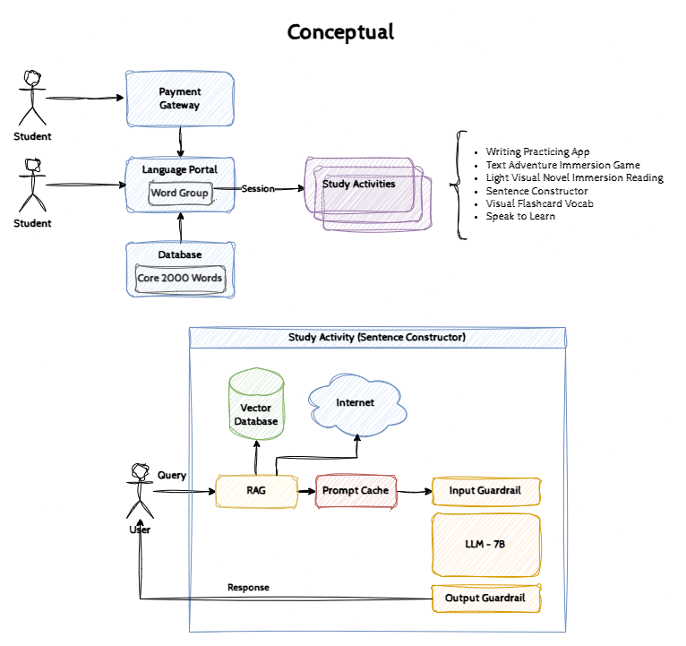

# GenAI Project Architecture

## Conceptual Diagram

## Requirements, Constraints, Assumptions, & Risks (RCAR)

### Requirements

| ID | Category | Requirement |
| :---: | --- | --- |
| R01 | Business | The company wants to invest in owning their own infrastructure. |
| R02 | Business | There is a privacy concern regarding user data. |
| R03 | Business | There is a financial concern that costs for GenAI managed services will significantly increase. |
| R04 | Business | The company is interested in a solution consisting of a single AI workstation / server system. |
| R05 | Business | There are 300 active students located in the city of _Barcelona, Spain_. |

### Constraints

| ID | Constraint |
| :---: | --- |
| C01 | Current estimated hardware budget of **$10,000 - $15,000**. |

### Assumptions

| ID | Assumption |
| :---: | --- |
| A01 | The chosen open-source large language models (LLMs) can fully utilize the hardware capabilities based on financial budget (C01).  |
| A02 | The existing office internet has sufficient bandwidth to support the single system (R04) providing service to all students (R05) concurrently. |

### Risks

| ID | Risk Item | Likelihood | Severity | Risk |
| :---: | --- | :---: | :---: | :---: |
| K01 | Current bandwidth is unable to support the new AI solution in addition to existing office traffic. | 2 | 1 | 🟩 Low |

|  | 
|:--:| 
| *Risk Assessment Matrix* |

:end: